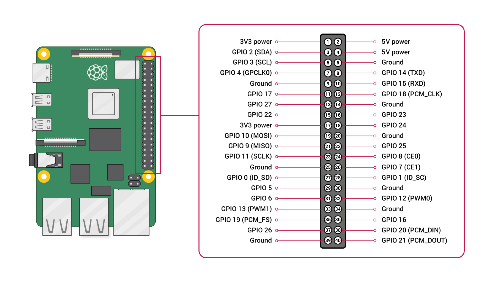

# Config-Datei

``` JSON
{
    // SPI-Konfiguration
    "spiServiceConfig": {
        // Anzahl der Bytes, die über SPI geschickt werden
        "byteLength": 6,
        // SPI-Taktfrequenz in Hz
        "speedHz": 1000,
        // SPI-Konfiguration der drei Sektoren-Mikrocontroller
        // "name": Sektor-Name (One, Two, Three)
        // "bus": Der Raspberry hat zwei SPI-Bussysteme, wir verwenden den Buss-1 für die Sektoren,
        // weil er drei Slave-Selects hat. Bus-0 hat nur zwei Slave-Selects (Treiber-Beschränkung)
        // "gpio": Slave-Select-Pin, fangt immer bei 0 an.
        // gpio des Buss-1: 0 - 1 - 2
        // gpio des Buss-0: 0 - 1 
        "mcDevices": [
            {
                "name": "One",
                "bus": 1,
                "gpio": 0
            },
            {
                "name": "Two",
                "bus": 1,
                "gpio": 1
            },
            {
                "name": "Three",
                "bus": 1,
                "gpio": 2
            }
        ],
        // SPI-Konfiguration des Beleuchtung-Mikrocontrollers
        "ambientDevice": {
            "name": "Ambient",
            "bus": 0,
            "gpio": 0
        },
        // Experimentaler Testmodus in dem die Plattform Simuliert wird  
        "fakeSpiMode": false
    },
    "socketServerConfig": {
        // Gibt an ab wie vielen Messages für die Webserver die Queue geleert wird
        "maxMessagesInQueue": 10,
        // Gibt an wie viel Zeit vergehen ohne neue Sim-data vergehen muss bis die Sim-Data auf resettet wird
        "simulationTimeout": 5000
    },
    "mainServiceConf": {
     // Die Zeit, nach der der Raspberry Daten von den Mikrocontrollern anfordert
        "arduinoDelay": 1000
    },
    "sensorConfig": {
        // Gibt an ab wie viel mm Höhenunterschied die Floating City das ausbalancieren beginnt
        "minimumMargin": 3,

        // Gibt an ab wie viel mm Höhenunterschied zum Durchschnitt die Pumpen auf 100% laufen
        "fullSpeedMargin": 20,

        // Einstellung für max/min Werte in mm beim äußeren Sensor
        "outerBounds": {
            "min": 30,
            "max": 250
        },

        // Einstellung für max/min Werte in mm beim inneren Sensor
        "innerBounds": {
            "min": 30,
            "max": 200
        }
    }
}

```
-7ebb11f8-2262-4247-a39f-be95d7fd7655.png)




# Ablauf
### Allgemeines 

Die App funktioniert mit dem Takt, der in der Config-Datei definiert ist (mainServiceConf.arduinoDelay).
Wir verwenden BehaviorSubjects für State-Management und haben zwei Subjects:
- **SimDataSubject**: hier werden die aktuellen Simulationsdaten gespeichert.
- **ModulesSubject**: hier werden die aktuellen Messungen der Sektoren gespeichert.

### Eingangspunkt
Der Main-Service ist der Eingangspunkt der App und verwalltet die gesamte Kommunikation. 

### Ein Takt
Zuerst werden die Daten der letzten Messung von dem Trim-Service analysiert und bei Bedarf angepasst, um die Lage der Stadt auszugleichen. Die angepasste Daten werden dann an die Sektoren gesendet und gleichzeitig (Duplex) werden die neuen Messungen gelesen und im ModulesSubject gespeichert. Der Socket-Service hört auf Änderungen des ModulesSubjects zu und schickt dem Windows-Server die neuen Daten zu. Der Socket-Service liefert die aktuellen Simulationsdaten und schreibt diese in das SimDataSubject. Es wird auf Änderungen des SimDataSubjects reagiert und  die Sonne-Daten an den Beleuchtung-Controller übertragt.

# Datenreichweite
## Pump & Generator
von -100 bis -1 => Pump Aktiv / Generator Inaktiv

von 1 bis 100 => Pump Inaktiv / Generator Aktiv

0 => Pump Inaktiv / Generator Inaktiv
